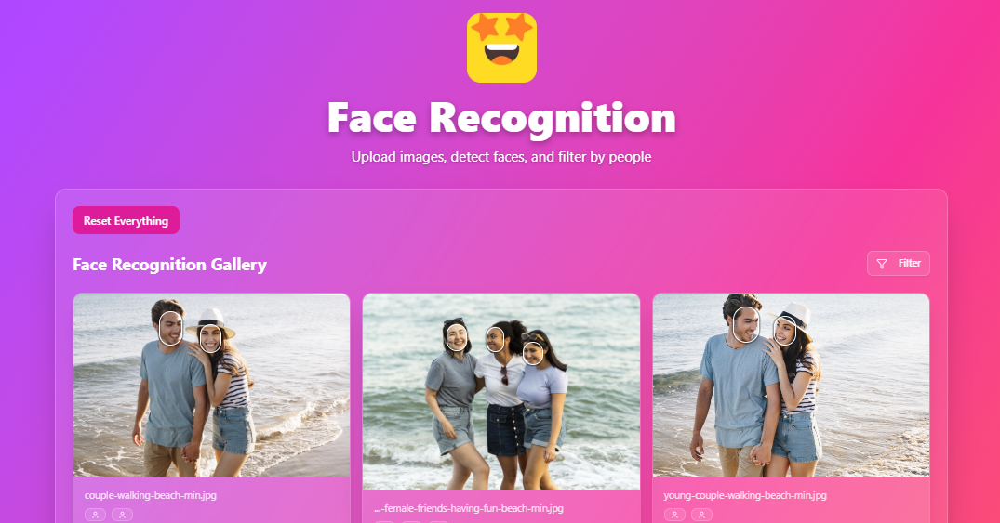
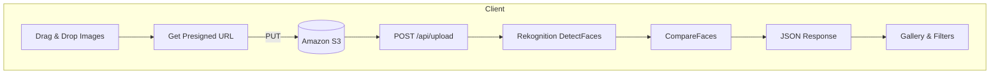

# Rekognition Batch Face Detection App
 

## Overview
This is a **Next.js 15** web application that lets users drag‑and‑drop images, uploads them to **Amazon S3** via pre‑signed URLs, and detects duplicate faces within the current batch using **Amazon Rekognition** (`DetectFaces` + `CompareFaces`).  
All processing runs inside standard **Next.js API routes**—no extra serverless framework or edge runtime required. The detected faces are clustered client‑side and rendered in an interactive gallery where each face can be renamed.

## Architecture



* **Next.js API Routes**  
  * `/api/upload` – upload to S3 files and calls Rekognition to analyse and compare faces. Return the processing data

* **State Management** – A single React Context (`ImageUploaderContext`) holds:
  * `files` – queued uploads  
  * `processedImages` – Rekognition results  
  * `uploadProgress`, `uploadedImages`

## Stack

| Layer | Technology | Purpose |
|-------|------------|---------|
| UI | Next.js 15, React 19, TypeScript, TailwindCSS | Modern, typesafe front‑end |
| Drag & Drop | `react-dropzone` | Accessible file input |
| Notifications | **Sonner** | Toast feedback |
| Storage | Amazon S3 (`PutObject` with pre‑signed URL) | Secure, server‑side signed uploads |
| Face Recognition | Amazon Rekognition `DetectFaces`, `CompareFaces` | Duplicate face detection |
| Lint / Format | ESLint, Prettier | Consistent codebase |

## Getting Started

### 1. Clone & Install

```bash
git clone https://github.com/RubenMoraAI/portfolio-rekognition.git
cd rekognition-app
npm install
npm run dev         # http://localhost:3000
```

### 2. Environment Variables

Create `.env.local`:

```dotenv
AWS_S3_ACCESS_KEY=
AWS_S3_SECRET_KEY=
AWS_S3_BUCKET=
AWS_S3_REGION=
AWS_S3_PATH=
```

### 3. Bootstrap S3

You need to configure your roles and bucket on AWS

### 4. Run

1. `npm run dev` – open `http://localhost:3000`.
2. Drop up to 10 images; watch progress bar and gallery populate, waiting for a few seconds and the gallery will show the images and faces found.
 
## Implementation Notes

* **Batch‑only deduplication** – We intentionally avoid Rekognition Collections; faces are compared only within the freshly uploaded batch to minimise cost and latency.
* **Strict TypeScript** – `strict` mode and ESLint rules prevent common bugs early.
* **Progress UI** – Uses `XMLHttpRequest#upload.onprogress` to update a Tailwind `Progress` bar; completion triggers a success toast.

## Contributing

1. Fork & create feature branch.
2. `npm run lint && npm test` before pushing.
3. Open a PR using Conventional Commits (`feat:`, `fix:`).

## License
MIT © 2025 Ruben Mora
